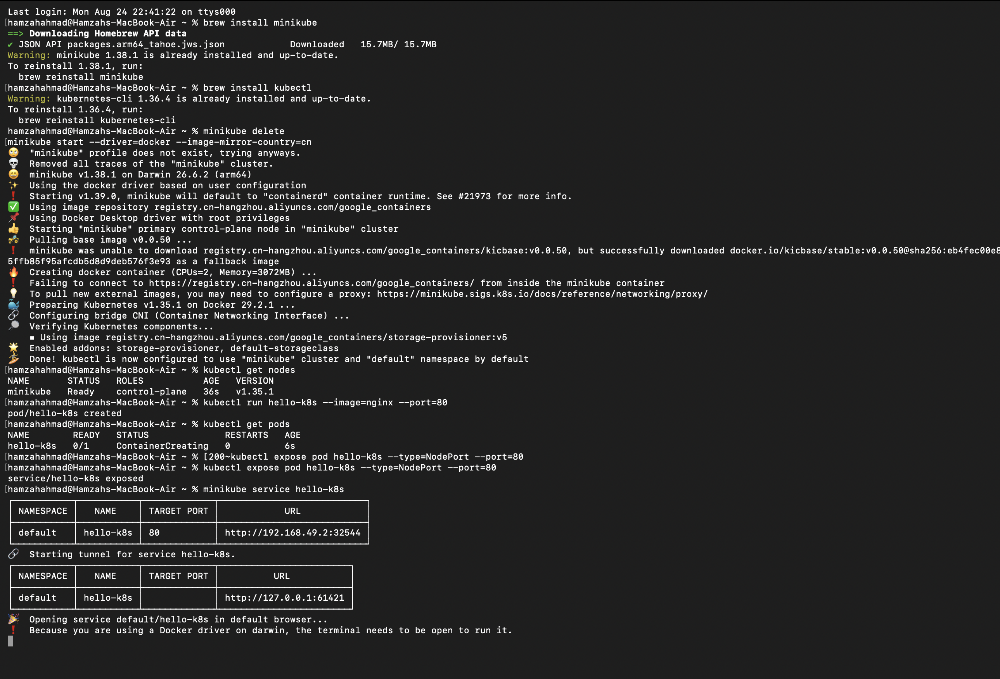

# Kubernetes Hands-On Exercise Series

**Exercise-1 Kubernetes (K8s) exercise!**

This activitie will help us to understand the basics of how Kubernetes runs and manages containerized applications.

## Business Problem (Zepto Example)

Imagine you are a **DevOps Engineer at Zepto**. The product team just built a lightweight **web app** that shows the **storefront and delivery status page** for customers.

Your task as the DevOps engineer:

**Deploy this app on Kubernetes** so that it is always running, portable, and can be scaled later. Simulate this using the popular `nginx` container image (think of it as Zepto's storefront web app).

## Exercise 1: Hello Pod

**Goal:** Run your first app inside Kubernetes and access it.

## Pre-Requisites

### 1. Install Minikube and kubectl (macOS, via Homebrew)

```bash
brew install minikube
brew install kubectl
```

> Docker Desktop must be installed and running, since this exercise uses the **docker** driver.

## Steps: Deploy Nginx Image as a Pod

**1. Start a local Kubernetes cluster with Minikube:**
```bash
minikube start --driver=docker
```

**2. Confirm the cluster is ready:**
```bash
kubectl get nodes
```



**3. Create your first Pod (using Nginx image):**
```bash
kubectl run hello-k8s --image=nginx --port=80
```

**4. Verify the Pod is running:**
```bash
kubectl get pods
```

**5. Expose the Pod as a Service:**
```bash
kubectl expose pod hello-k8s --type=NodePort --port=80
```

**6. Open the app in your browser:**
```bash
minikube service hello-k8s
```

You should see the Nginx welcome page. **Congratulations, you just deployed your first container in Kubernetes!**

## Troubleshooting Notes

While running this exercise, `minikube start` initially failed to pull Kubernetes system images with:

Failing to connect to https://registry.k8s.io/ from both inside the minikube container and host machine


This was a network-level block on the default image registry, not a configuration error. It was resolved by routing image pulls through an alternate mirror:

```bash
minikube delete
minikube start --driver=docker --image-mirror-country=cn
```

This swapped the image source to `registry.cn-hangzhou.aliyuncs.com/google_containers`, which was reachable, and the cluster came up successfully.
