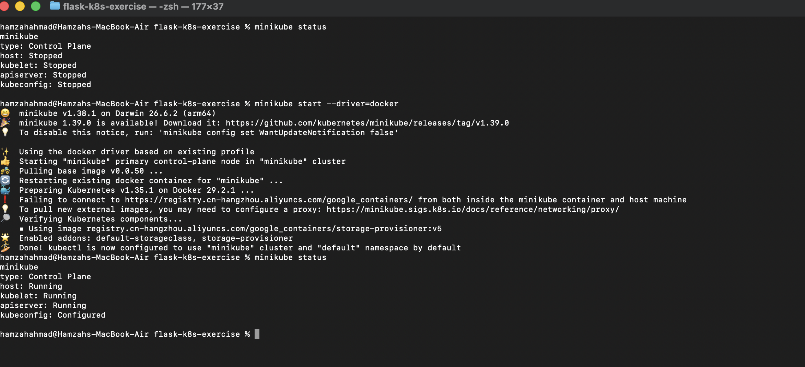
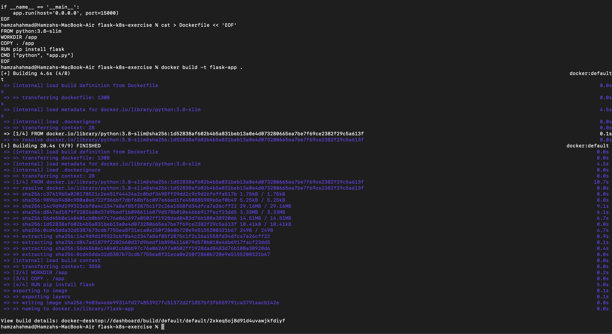
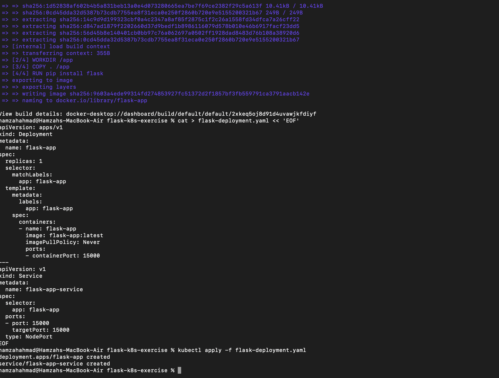
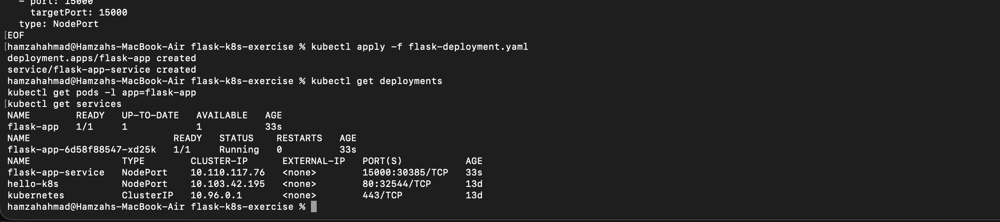
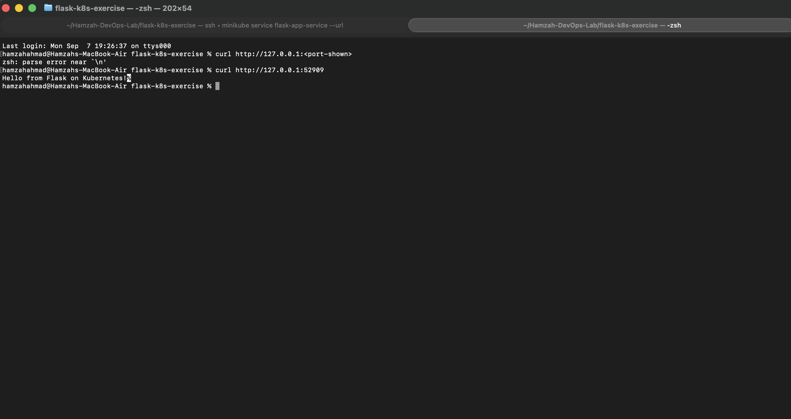

# Exercise 2: Deploy a Flask App on Minikube using kubectl and YAML

## Objective
Deploy a Python Flask application on a local Kubernetes cluster (Minikube) using a custom Docker image, a Deployment, and a Service.

## Steps

**1. Confirm Minikube is running**
```bash
minikube status
```


**2. Point Docker CLI at Minikube's daemon**
```bash
eval $(minikube docker-env)
```

**3. Create the Flask app** (`app.py`)
```python
from flask import Flask
app = Flask(__name__)

@app.route('/')
def home():
    return "Hello from Flask on Kubernetes!"

if __name__ == '__main__':
    app.run(host='0.0.0.0', port=15000)
```

**4. Create the Dockerfile**
```dockerfile
FROM python:3.8-slim
WORKDIR /app
COPY . /app
RUN pip install flask
CMD ["python", "app.py"]
```

**5. Build the image inside Minikube's Docker daemon**
```bash
docker build -t flask-app .
```


**6. Create the Deployment + Service YAML** (`flask-deployment.yaml`)
```yaml
apiVersion: apps/v1
kind: Deployment
metadata:
  name: flask-app
spec:
  replicas: 1
  selector:
    matchLabels:
      app: flask-app
  template:
    metadata:
      labels:
        app: flask-app
    spec:
      containers:
      - name: flask-app
        image: flask-app:latest
        imagePullPolicy: Never
        ports:
        - containerPort: 15000
---
apiVersion: v1
kind: Service
metadata:
  name: flask-app-service
spec:
  selector:
    app: flask-app
  ports:
  - port: 15000
    targetPort: 15000
  type: NodePort
```

**7. Deploy it**
```bash
kubectl apply -f flask-deployment.yaml
```


**8. Verify deployment, pods, and service**
```bash
kubectl get deployments
kubectl get pods -l app=flask-app
kubectl get services
```


**9. Access the app**
```bash
minikube service flask-app-service --url
```
Keep the terminal open, then in a new terminal:
```bash
curl http://127.0.0.1:<port>
```


Response: `Hello from Flask on Kubernetes!` — the Flask application is successfully deployed and reachable through the Kubernetes Service.
