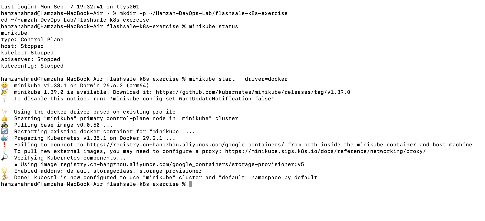
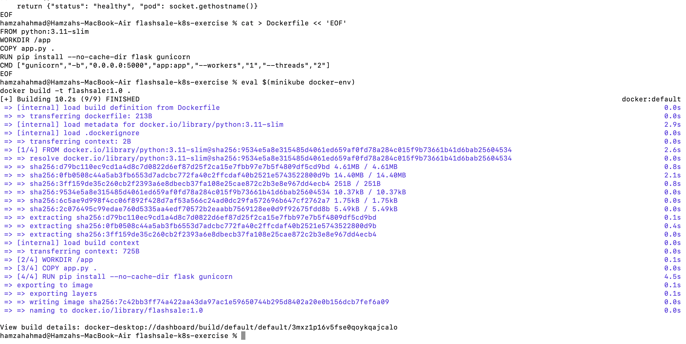
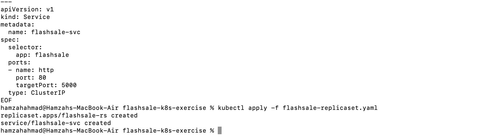
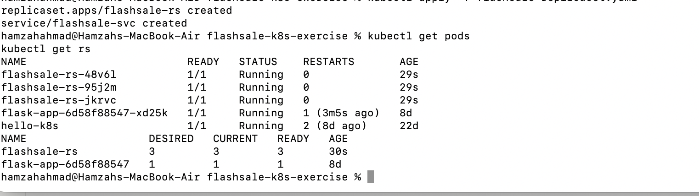
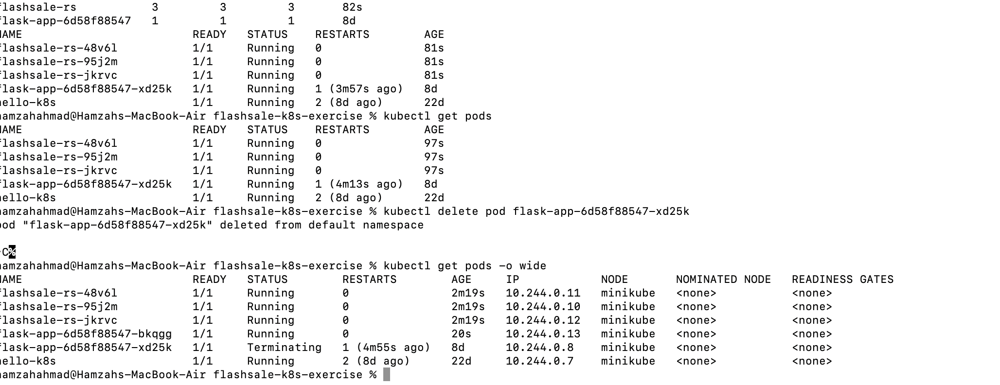

# Exercise 3: Scaling a Flask App Using ReplicaSets

## Real-Life Use Case: E-commerce Flash Sale
During a flash sale (e.g. Big Billion Days, Prime Day), traffic can spike from ~100 requests/minute to 10,000+ requests/minute. A single Pod would crash under this load. ReplicaSets let Kubernetes scale out to many identical Pods to distribute traffic, then scale back down once demand drops.

## Objective
- Understand ReplicaSets and Pods
- Scale a Flask app deployment
- Observe pod distribution and self-healing

## App: Flash Sale Checkout Service

```python
from flask import Flask, request
import socket, time, random

app = Flask(__name__)

@app.get("/")
def homepage():
    return {"message": "Welcome to Big Sale!", "pod": socket.gethostname(), "ts": time.time()}

@app.get("/buy")
def buy():
    item = random.choice(["Smartphone", "Shoes", "Headphones", "Laptop"])
    user = request.args.get("user", f"user{random.randint(1,1000)}")
    return {"status": "success", "item": item, "user": user, "served_by_pod": socket.gethostname(), "time": time.strftime("%H:%M:%S")}

@app.get("/health")
def health():
    return {"status": "healthy", "pod": socket.gethostname()}
```

## Dockerfile

```dockerfile
FROM python:3.11-slim
WORKDIR /app
COPY app.py .
RUN pip install --no-cache-dir flask gunicorn
CMD ["gunicorn","-b","0.0.0.0:5000","app:app","--workers","1","--threads","2"]
```

## Step 1: Confirm Minikube is running

```bash
minikube status
```



## Step 2: Build the image into Minikube's Docker daemon

```bash
eval $(minikube docker-env)
docker build -t flashsale:1.0 .
```



## Step 3: ReplicaSet + Service YAML

```yaml
apiVersion: apps/v1
kind: ReplicaSet
metadata:
  name: flashsale-rs
  labels:
    app: flashsale
spec:
  replicas: 3
  selector:
    matchLabels:
      app: flashsale
  template:
    metadata:
      labels:
        app: flashsale
    spec:
      containers:
      - name: flashsale-container
        image: flashsale:1.0
        imagePullPolicy: Never
        ports:
        - containerPort: 5000
        readinessProbe:
          httpGet:
            path: /health
            port: 5000
          initialDelaySeconds: 2
          periodSeconds: 5
        livenessProbe:
          httpGet:
            path: /health
            port: 5000
          initialDelaySeconds: 10
          periodSeconds: 10
        resources:
          requests:
            cpu: "100m"
            memory: "128Mi"
          limits:
            cpu: "500m"
            memory: "256Mi"
---
apiVersion: v1
kind: Service
metadata:
  name: flashsale-svc
spec:
  selector:
    app: flashsale
  ports:
  - name: http
    port: 80
    targetPort: 5000
  type: ClusterIP
```

## Step 4: Apply the ReplicaSet

```bash
kubectl apply -f flashsale-replicaset.yaml
```



## Step 5: Verify initial pods and ReplicaSet

```bash
kubectl get pods
kubectl get rs
```



3 Pods come up, all `Running`.

## Step 6: Scale up to 5 replicas

```bash
kubectl scale rs flashsale-rs --replicas=5
kubectl get rs
kubectl get pods
```

## Step 7: Delete a pod and observe self-healing

```bash
kubectl delete pod <pod-name>
kubectl get pods -o wide
```



Kubernetes immediately terminates the deleted pod and spins up a replacement to maintain the desired replica count. All pods run on the single Minikube node (`minikube`), each with a unique internal IP.

## Key Observations

- **Pod Distribution** — each Pod is an identical worker; scaling creates clones of the app.
- **Resiliency** — deleting a pod triggers automatic replacement, so users see no downtime.
- **Efficiency** — Pods are added under load and removed when demand drops, avoiding over-provisioning.
- **Real-World Parallel** — this is how Netflix, YouTube, and Swiggy scale microservices during peak traffic.

## Q&A

**Q1: What is the initial number of replicas?**
A: 3

**Q2: What happens when scaling to 5 replicas?**
A: Kubernetes creates 2 additional pods to reach the desired count of 5.

**Q3: What happens when a pod is deleted?**
A: Kubernetes automatically creates a new pod to replace it, maintaining the desired replica count.

**Q4: How does Kubernetes maintain the desired replica count?**
A: It continuously compares actual running pods to the desired count and creates or deletes pods to reconcile any difference.

**Q5: How many nodes were used?**
A: 1 (single-node Minikube cluster) — all pods scheduled on the same node.
