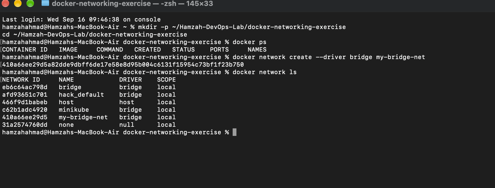
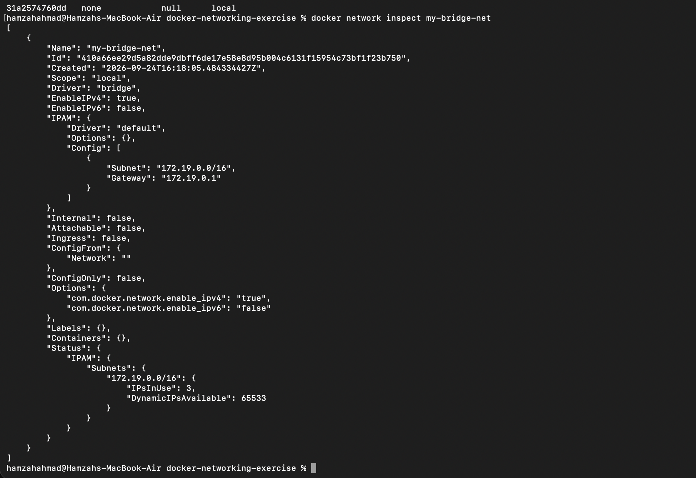
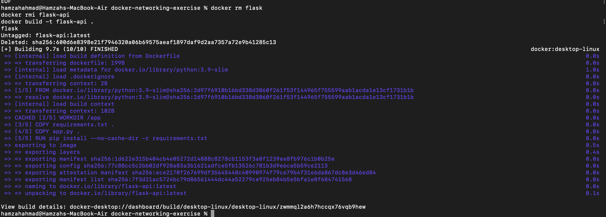
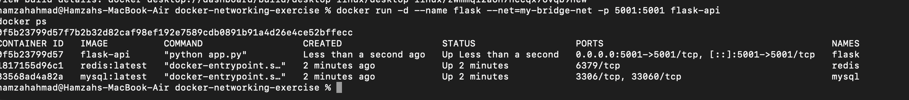
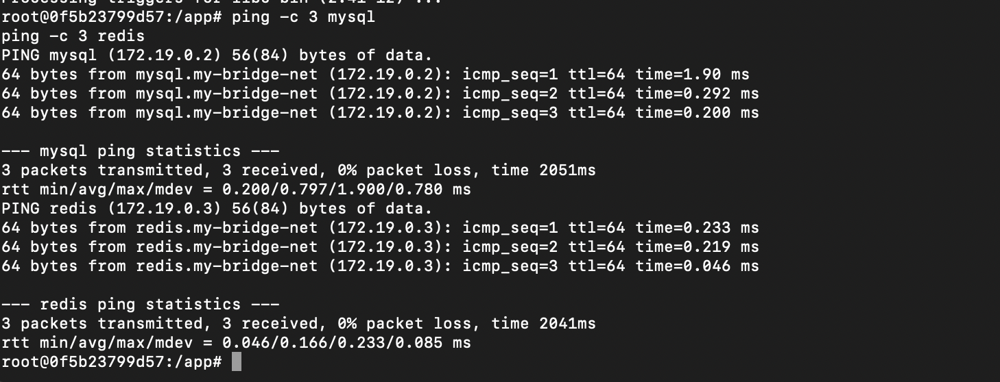
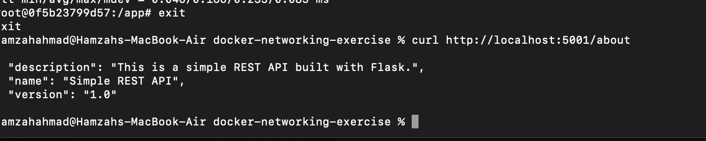

# Exercise 4: Docker Networking with Multiple Containers

## Objective
Understand Docker networking concepts and configure a multi-container application where services communicate over a custom bridge network.

## Scenario
A web application composed of three containers:
- A Python Flask web server
- A MySQL database
- A Redis cache

## Step 1: Create a bridge network

```bash
docker network create --driver bridge my-bridge-net
```

## Step 2: Verify the network

```bash
docker network ls
```



## Step 3: Inspect the network

```bash
docker network inspect my-bridge-net
```



## Step 4: Flask app

`app.py`
```python
from flask import Flask, jsonify

app = Flask(__name__)

@app.route('/about', methods=['GET'])
def about():
    return jsonify({
        "name": "Simple REST API",
        "version": "1.0",
        "description": "This is a simple REST API built with Flask."
    })

if __name__ == '__main__':
    app.run(debug=True, host='0.0.0.0', port=5001)
```

`requirements.txt`

Flask==2.0.1
Werkzeug==2.0.3


> **Note:** The original exercise pinned only `Flask==2.0.1`, but that version depends on an internal Werkzeug function (`url_quote`) that was removed in newer Werkzeug releases. Pinning `Werkzeug==2.0.3` alongside Flask resolved an `ImportError` on container startup.

`Dockerfile`
```dockerfile
FROM python:3.9-slim
WORKDIR /app
COPY requirements.txt .
COPY app.py .
RUN pip install --no-cache-dir -r requirements.txt
EXPOSE 5001
CMD ["python", "app.py"]
```

## Step 5: Build the Flask image

```bash
docker build -t flask-api .
```



## Step 6: Launch all three containers on the bridge network

```bash
docker run -d --name mysql --net=my-bridge-net -e MYSQL_ROOT_PASSWORD=rootpass mysql:latest
docker run -d --name redis --net=my-bridge-net redis:latest
docker run -d --name flask --net=my-bridge-net -p 5001:5001 flask-api
```

> **Note:** The official MySQL image requires a root password to be set via `MYSQL_ROOT_PASSWORD`, or it refuses to start.

```bash
docker ps
```



## Step 7: Test connectivity between containers

```bash
docker exec -it flask bash
```

Inside the container (the `python:3.9-slim` base image doesn't include `ping` by default, so it was installed first):

```bash
apt-get update && apt-get install -y iputils-ping
ping -c 3 mysql
ping -c 3 redis
```



Both containers responded, confirming they can resolve each other by name and communicate over the bridge network.

## Step 8: Test the Flask API from the host machine

```bash
curl http://localhost:5001/about
```



```json
{
  "description": "This is a simple REST API built with Flask.",
  "name": "Simple REST API",
  "version": "1.0"
}
```

## Step 9: Clean up

```bash
docker stop mysql redis flask
docker rm mysql redis flask
docker network rm my-bridge-net
```

## Q&A

**Q1: What is the purpose of the `--net` flag in `docker run`?**
A: It specifies which Docker network the container should connect to.

**Q2: How do containers communicate with each other on the same network?**
A: Containers on the same user-defined bridge network can resolve each other by container name via Docker's built-in DNS, and communicate over their internal IPs.

**Q3: What is the difference between a bridge network and a host network?**
A: A bridge network isolates containers on a private virtual network, requiring explicit port mapping to reach them from outside. A host network shares the host machine's network stack directly, with no isolation.

**Q4: How can you expose a container's port to the host machine?**
A: Use the `-p` flag, e.g. `-p 5001:5001`, to map a container port to a host port.
