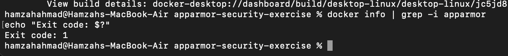
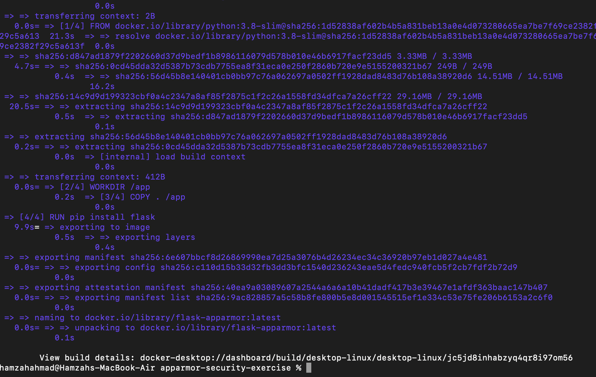
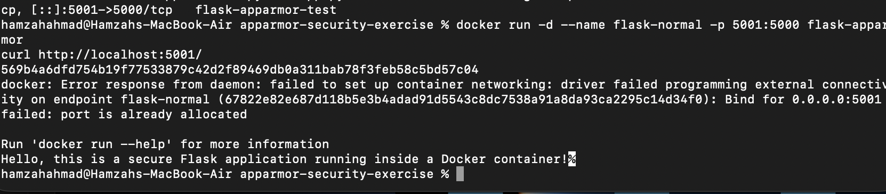

# Exercise 5: Docker Security with AppArmor and Python

## Objective
Understand how to secure Docker containers using AppArmor profiles, apply them via the Docker SDK for Python, and test restricted actions inside a container.

## Scenario
A Python Flask web application is containerized with Docker. The goal is to restrict the container's access to sensitive directories and prevent unauthorized actions (e.g. executing binaries, reading system files) using an AppArmor security profile.

## Platform Finding: AppArmor Is Not Available on This Setup

Before applying any profile, the environment was checked for AppArmor support:

```bash
docker info | grep -i apparmor
echo "Exit code: $?"
```



Result: no AppArmor entries at all, exit code `1` (no match found). This is expected — **AppArmor is a Linux kernel LSM (Linux Security Module)**, and Docker Desktop on macOS runs containers inside a lightweight Linux VM that does not compile in AppArmor support. This is a genuine platform limitation, not a configuration mistake: AppArmor works natively on Ubuntu/Debian hosts, but is simply unavailable through Docker Desktop on macOS (and is similarly inconsistent on Windows/WSL2).

## Step 1: Flask Application

`app.py`
```python
from flask import Flask

app = Flask(__name__)

@app.route('/')
def home():
    return "Hello, this is a secure Flask application running inside a Docker container!"

if __name__ == '__main__':
    app.run(host='0.0.0.0', port=5000)
```

## Step 2: Dockerfile

```dockerfile
FROM python:3.8-slim
WORKDIR /app
COPY . /app
RUN pip install flask
EXPOSE 5000
CMD ["python", "app.py"]
```

## Step 3: Build the image

```bash
docker build -t flask-apparmor .
```



## Step 4: Attempt to run with an AppArmor security profile

```bash
docker run --security-opt="apparmor=my-apparmor-profile" -p 5001:5000 -d --name flask-apparmor-test flask-apparmor
```

> **Note:** Port 5000 was already in use locally by macOS's built-in AirPlay Receiver service, so the container was mapped to host port `5001` instead.


Result: the container **started successfully** even though no AppArmor profile exists on this host. Docker did not reject the `--security-opt` flag — it was silently accepted and had no enforcement effect, since the underlying VM has no AppArmor LSM to apply it against. This itself is a useful security finding: unsupported security flags can fail silently rather than erroring loudly, which is worth being aware of in real deployments.

## Step 5: Confirm the application works normally

```bash
docker run -d --name flask-normal -p 5001:5000 flask-apparmor
curl http://localhost:5001/
```



Response: `Hello, this is a secure Flask application running inside a Docker container!` — confirming the application itself is fully functional; the only missing piece is the AppArmor enforcement layer, due to the host platform.

## Step 6: Clean up

```bash
docker stop flask-normal flask-apparmor-test
docker rm flask-normal flask-apparmor-test
docker rmi flask-apparmor
```

## What a Working AppArmor Profile Would Do

For reference, on a Linux host with AppArmor available, the profile for this exercise would look like:

#include <tunables/global>

/usr/bin/python3 {
deny /etc/** r,
deny /var/** rw,
network inet stream,
/app/** rwk,
deny /bin/** rmix,
deny /usr/bin/** rmix,
capability net_bind_service,
deny capability sys_admin,
}


It would be loaded with `sudo apparmor_parser -r /etc/apparmor.d/my-apparmor-profile` and applied via `docker run --security-opt="apparmor=my-apparmor-profile" ...`, then verified and tested using the Docker SDK for Python (`docker.from_env()`, `container.exec_run(...)`), checking that restricted actions like `cat /etc/passwd` or executing `/bin/bash` return non-zero exit codes.

## Q&A

**Q1: What is the purpose of using AppArmor with Docker containers?**
A: AppArmor enforces mandatory access control policies that confine what a containerized application can access — files, network, binaries — adding a security layer beyond Docker's default isolation.

**Q2: How do AppArmor profiles help secure a Docker container?**
A: Profiles explicitly allow or deny access to specific paths, capabilities, and network actions, so even if an application is compromised, its blast radius is limited to what the profile permits.

**Q3: Why is it important to restrict access to sensitive directories such as `/etc/` and `/var/`?**
A: These directories hold system configuration and credentials. Unrestricted access would let a compromised container read or tamper with host-level settings and sensitive data.

**Q4: What other capabilities can you restrict using AppArmor profiles?**
A: Network binding, binary execution, write access to specific paths, and Linux capabilities such as `cap_sys_admin` (which grants broad administrative control).

**Q5: How can you verify if an AppArmor profile is successfully applied to a Docker container?**
A: Inspect the container (`docker inspect` or the Docker SDK's `client.api.inspect_container()`) and check the `HostConfig.SecurityOpt` field, which lists the applied security options including the AppArmor profile name. Note: as this exercise demonstrated, the field reflecting the flag does not by itself guarantee the profile is being *enforced* — that also depends on the host actually supporting AppArmor.
