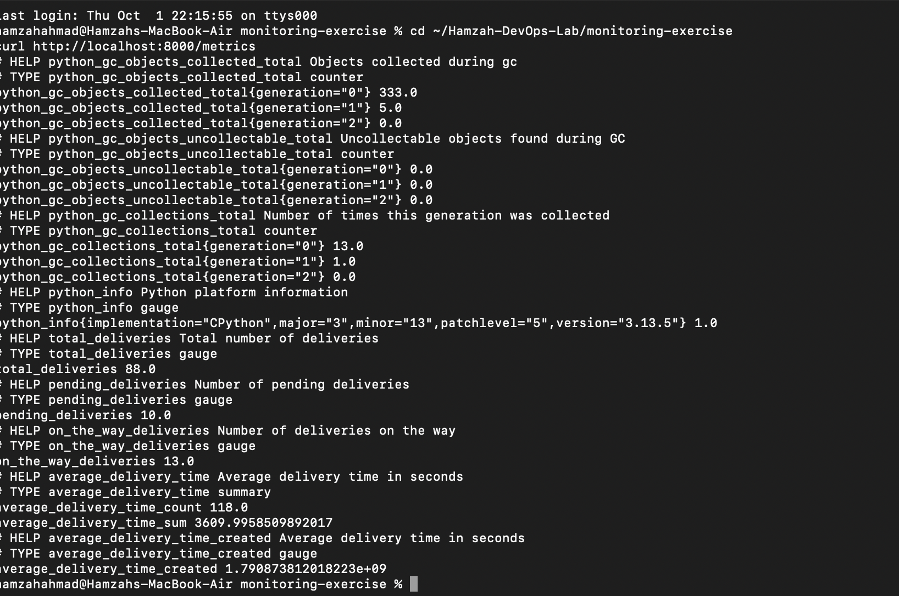
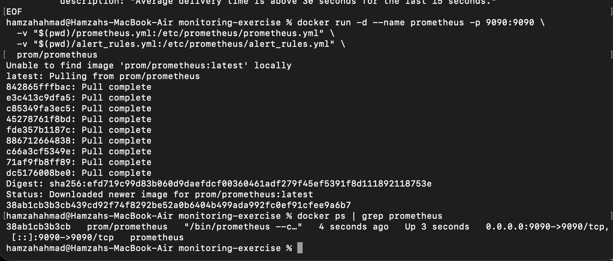
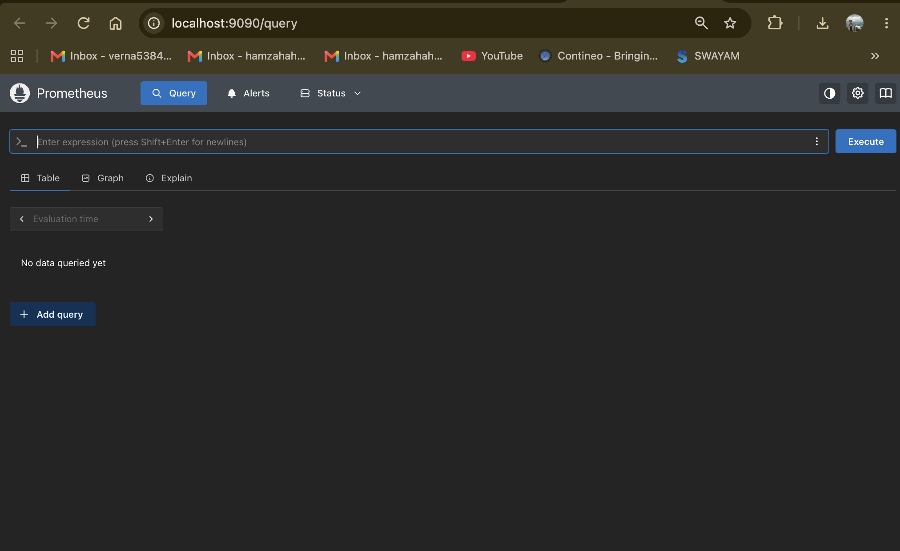
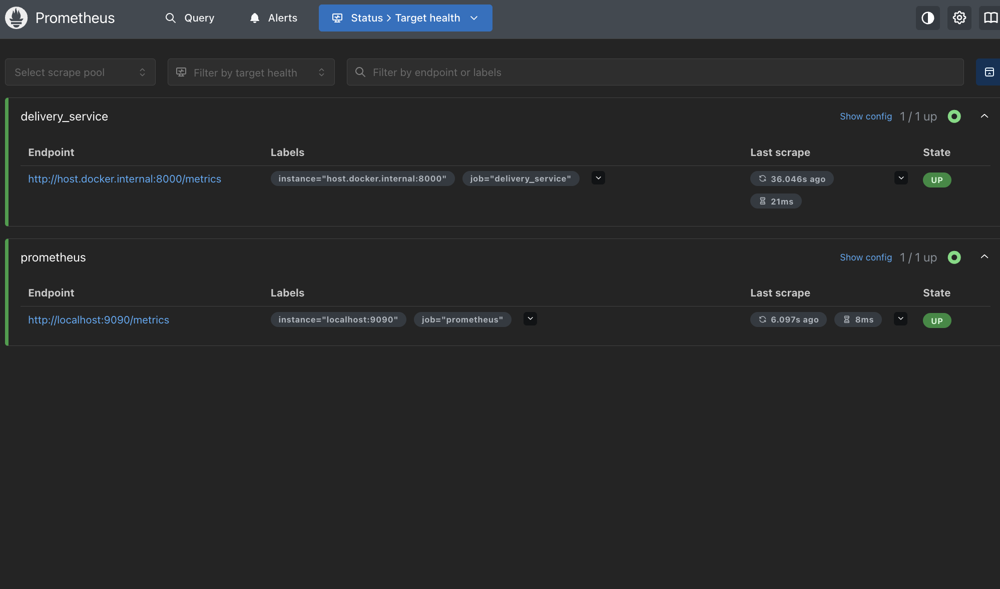
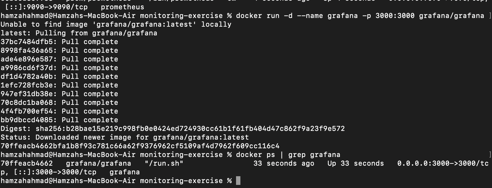
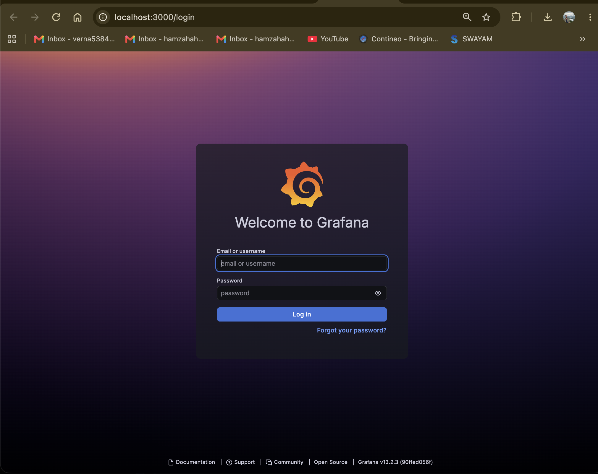
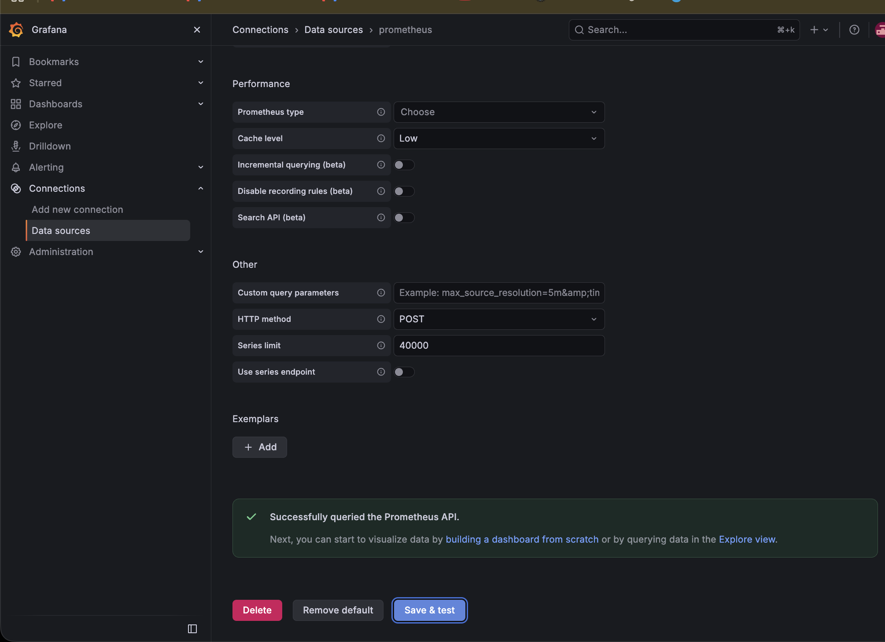
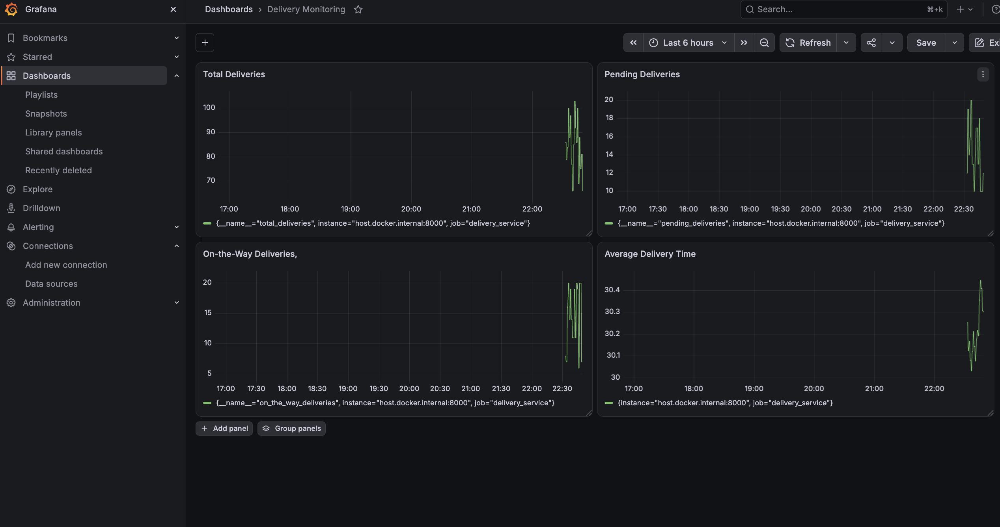
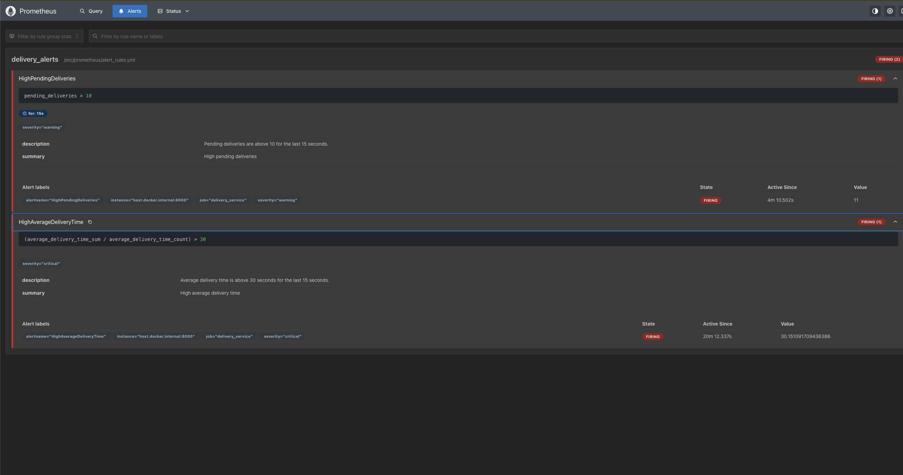

# Exercise 6: Real-Time Operations Monitoring and Alerting

## Objective
Build a monitoring pipeline for a simulated delivery service, using Python to generate live metrics, Prometheus to scrape and alert on them, and Grafana to visualize them on a dashboard.

## Scenario
As a DevOps engineer at a delivery service, create a pipeline that simulates delivery metrics, visualizes them on dashboards, and sets up automated alerts to catch operational issues in real time.

## Platform Note: macOS Docker Networking

The original exercise relies on Linux-specific networking (`--network=host` and the bridge IP `172.17.0.1`) so containers can reach a script running on the host machine. **Docker Desktop for macOS does not support host networking the same way**, since containers run inside a lightweight VM rather than sharing the host's network stack directly.

The fix used throughout this exercise: Docker Desktop provides a special DNS name, **`host.docker.internal`**, that resolves to the host machine from inside any container. However, on this setup it did not resolve automatically — both Prometheus and Grafana containers needed to be launched with an explicit `--add-host=host.docker.internal:host-gateway` flag to force correct DNS resolution.

## Step 1: Install the Python package

```bash
pip3 install prometheus-client
```

## Step 2: Write the metrics simulation script

`delivery_metrics.py`
```python
from prometheus_client import start_http_server, Summary, Gauge
import random
import time

total_deliveries = Gauge("total_deliveries", "Total number of deliveries")
pending_deliveries = Gauge("pending_deliveries", "Number of pending deliveries")
on_the_way_deliveries = Gauge("on_the_way_deliveries", "Number of deliveries on the way")
average_delivery_time = Summary("average_delivery_time", "Average delivery time in seconds")

def simulate_delivery():
    pending = random.randint(10, 20)
    on_the_way = random.randint(5, 20)
    delivered = random.randint(30, 70)
    avg_time = random.uniform(15, 45)

    total = pending + on_the_way + delivered

    total_deliveries.set(total)
    pending_deliveries.set(pending)
    on_the_way_deliveries.set(on_the_way)
    average_delivery_time.observe(avg_time)

if __name__ == "__main__":
    start_http_server(8000, addr="0.0.0.0")
    while True:
        simulate_delivery()
        time.sleep(1)
```

Run it in the background:
```bash
python3 delivery_metrics.py &
```

## Step 3: Verify the metrics endpoint

```bash
curl http://localhost:8000/metrics
```



Custom metrics (`total_deliveries`, `pending_deliveries`, `on_the_way_deliveries`, `average_delivery_time`) appear alongside Python's default process metrics.

## Step 4: Configure Prometheus

`prometheus.yml`
```yaml
scrape_configs:
  - job_name: "prometheus"
    static_configs:
      - targets: ["localhost:9090"]

  - job_name: "delivery_service"
    static_configs:
      - targets: ["host.docker.internal:8000"]

rule_files:
  - /etc/prometheus/alert_rules.yml
```

## Step 5: Configure alert rules

`alert_rules.yml`
```yaml
groups:
  - name: delivery_alerts
    rules:
      - alert: HighPendingDeliveries
        expr: pending_deliveries > 10
        for: 15s
        labels:
          severity: warning
        annotations:
          summary: "High pending deliveries"
          description: "Pending deliveries are above 10 for the last 15 seconds."

      - alert: HighAverageDeliveryTime
        expr: (average_delivery_time_sum / average_delivery_time_count) > 30
        labels:
          severity: critical
        annotations:
          summary: "High average delivery time"
          description: "Average delivery time is above 30 seconds for the last 15 seconds."
```

## Step 6: Run Prometheus

```bash
docker run -d --name prometheus -p 9090:9090 \
  --add-host=host.docker.internal:host-gateway \
  -v "$(pwd)/prometheus.yml:/etc/prometheus/prometheus.yml" \
  -v "$(pwd)/alert_rules.yml:/etc/prometheus/alert_rules.yml" \
  prom/prometheus
```



Access at [http://localhost:9090](http://localhost:9090):



## Step 7: Verify Prometheus targets

**Status → Targets**



Both `prometheus` and `delivery_service` show as `UP`, confirming Prometheus is successfully scraping metrics from the Python script via `host.docker.internal`.

## Step 8: Run Grafana

```bash
docker run -d --name grafana -p 3000:3000 \
  --add-host=host.docker.internal:host-gateway \
  grafana/grafana
```



Access at [http://localhost:3000](http://localhost:3000):



Log in with `admin` / `admin`, then skip the password change prompt.

## Step 9: Add Prometheus as a Grafana data source

**Connections → Data sources → Add data source → Prometheus**

URL: http://host.docker.internal:9090




## Step 10: Build the dashboard

Created a dashboard named **Delivery Monitoring** with four panels, each querying Prometheus directly:

| Panel | PromQL Query |
|---|---|
| Total Deliveries | `total_deliveries` |
| Pending Deliveries | `pending_deliveries` |
| On-the-Way Deliveries | `on_the_way_deliveries` |
| Average Delivery Time | `average_delivery_time_sum / average_delivery_time_count` |



All four panels populate with live, real-time data from the running Python script.

## Step 11: Verify alerts are firing

**Prometheus → Alerts**



Both alert rules are actively firing:
- **HighPendingDeliveries** (`warning`) — value `11`, over the threshold of `10`
- **HighAverageDeliveryTime** (`critical`) — value `~30.15`, over the threshold of `30`

This confirms the full pipeline works end-to-end: the Python script generates metrics → Prometheus scrapes and evaluates them against the alert rules → Grafana visualizes them live.

## Note: Jenkins Pipeline

The original exercise includes a Jenkins stage to automate building and running this entire stack via a `Jenkinsfile`. This was intentionally left out of this run to keep the exercise focused on the monitoring stack itself (Python → Prometheus → Grafana), which is the core learning objective. Jenkins pipeline automation is a natural follow-up exercise.

## Expected Outputs — Achieved

1. **Metrics Endpoint** — confirmed working at `http://localhost:8000/metrics`
2. **Prometheus Scraping** — both targets `UP`, scraping every ~15s
3. **Grafana Dashboard** — all four panels visualizing live delivery metrics
4. **Prometheus Alerts** — both alert rules actively firing based on real threshold breaches
