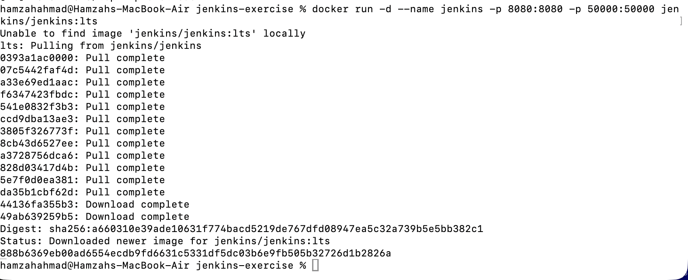
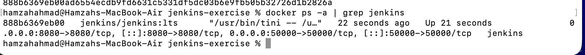
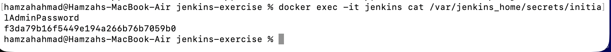
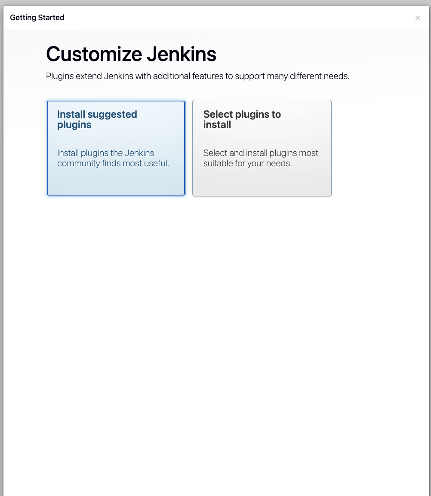
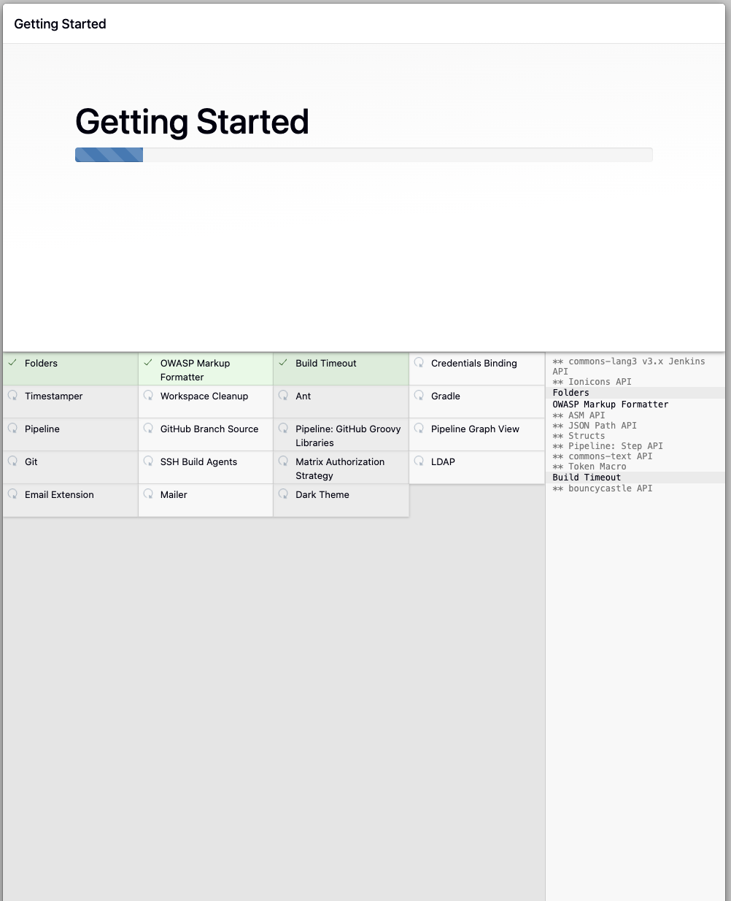
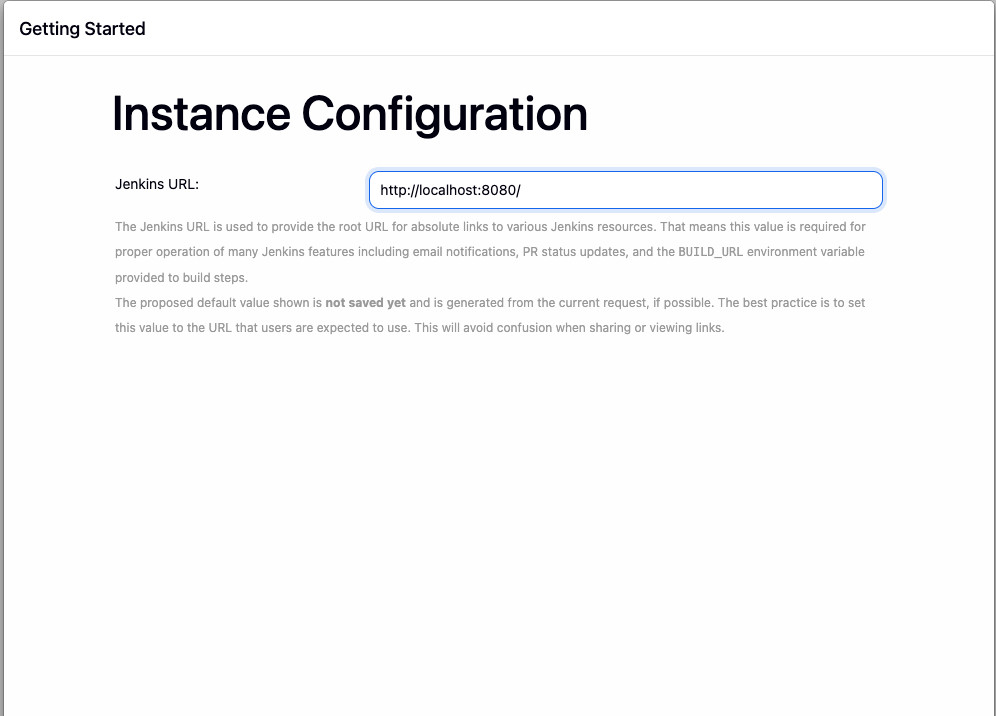
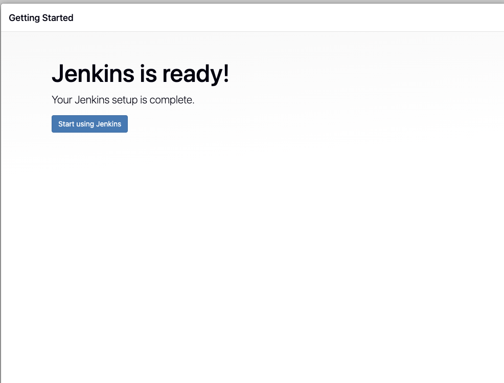
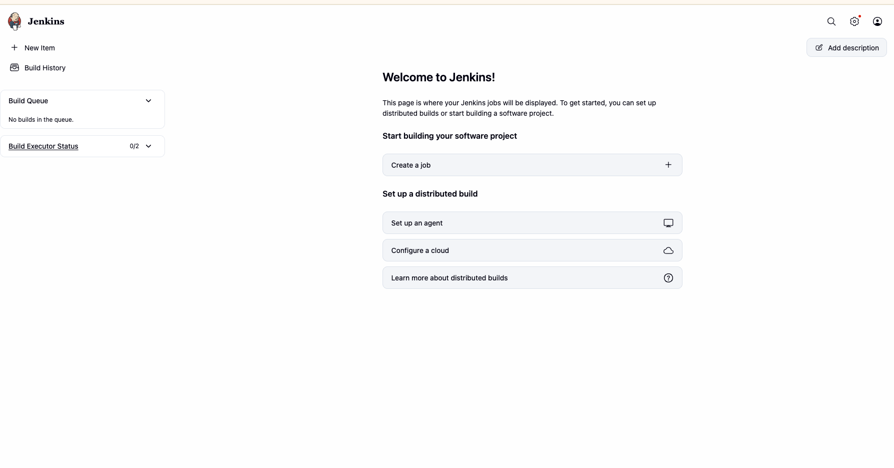

# Exercise 7: Introduction to Continuous Integration (CI) and Jenkins Installation

## What is Continuous Integration (CI)?
Continuous Integration is a development practice where developers frequently integrate code changes into a shared repository. Each integration is automatically built and tested, catching errors early and improving software quality.

## Key Features of CI
- **Frequent Code Integration** — developers commit changes multiple times a day
- **Automated Builds** — every commit triggers an automated build
- **Automated Testing** — tests run automatically to catch regressions
- **Immediate Feedback** — developers get quick signal on whether their changes broke anything

## Benefits of CI
- Early bug detection, before issues compound
- Improved collaboration across a shared codebase
- Faster development cycles through automation
- Higher overall code quality via continuous testing

## How CI Works
1. A developer pushes code to version control (e.g. Git)
2. The CI server detects the change and triggers a build
3. The codebase is compiled and dependencies resolved
4. Automated tests run to verify functionality
5. Results are reported back to the developer


## What is Jenkins?
Jenkins is an open-source automation server used to build, test, and deploy software, enabling both Continuous Integration and Continuous Delivery. It's extensible via plugins, can run distributed builds across multiple machines, and remains one of the most widely used CI servers.

## Key Jenkins Concepts
- **Job/Project** — a task or process Jenkins runs
- **Build** — the process of compiling and packaging code
- **Pipeline** — a series of steps to build, test, and deploy an application
- **Plugins** — extend Jenkins' functionality (Git, Docker, etc.)
- **Nodes** — machines where Jenkins runs jobs (Master/Agent setup)

## Installing Jenkins via Docker

### Step 1: Run the Jenkins container

```bash
docker run -d --name jenkins -p 8080:8080 -p 50000:50000 jenkins/jenkins:lts
```



### Step 2: Verify the container is running

```bash
docker ps -a | grep jenkins
```



### Step 3: Retrieve the initial admin password

```bash
docker exec -it jenkins cat /var/jenkins_home/secrets/initialAdminPassword
```



### Step 4: Access Jenkins and unlock it

Open [http://localhost:8080](http://localhost:8080) and paste the password from Step 3.



### Step 5: Install suggested plugins



### Step 6: Create an admin user, then confirm the instance URL

The default instance URL (`http://localhost:8080`) is correct for local use.



### Step 7: Jenkins is ready





Jenkins is now fully installed, unlocked, and accessible at `http://localhost:8080`, ready to create and run CI/CD pipeline jobs.

## Next Steps
With Jenkins running, the natural follow-up is building an actual pipeline job (a `Jenkinsfile`) that automates building, testing, and deploying one of the applications from earlier exercises — e.g. the Flask app or the delivery monitoring stack.
