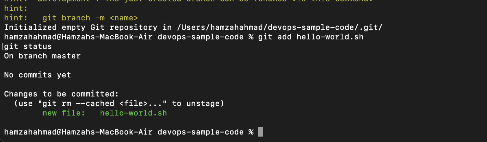
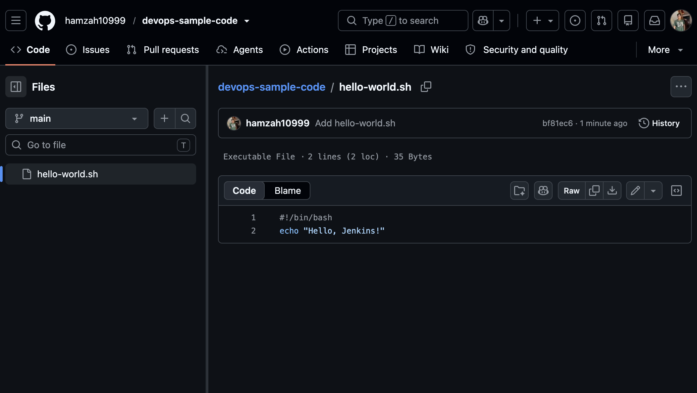
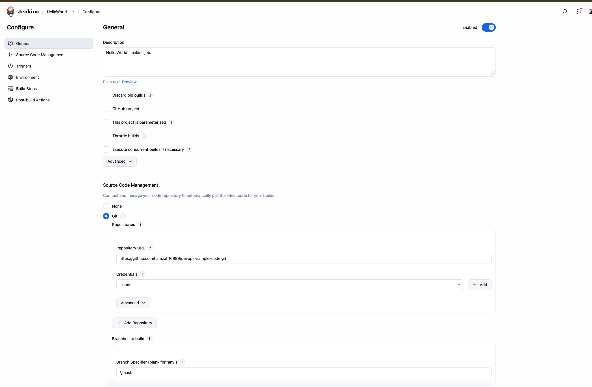
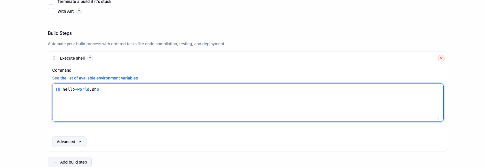
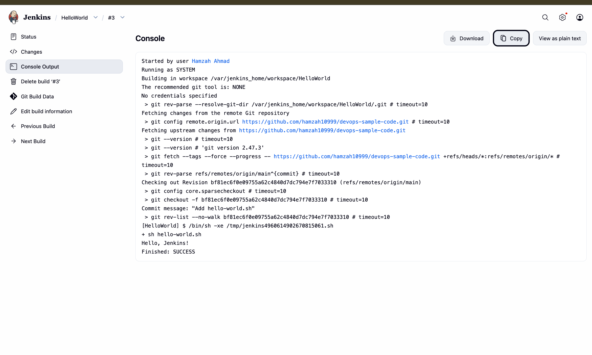

# Exercise 8: Creating a "Hello World" Jenkins Job

## Objective
Create a GitHub repository containing a simple shell script, then configure a Jenkins Freestyle job to clone that repository and execute the script — demonstrating a basic CI pipeline from source control to build execution.

## Step 1: Create the GitHub Repository

Created a new public repository on GitHub named `devops-sample-code`, with no initial README (so the first push would set up the repo from scratch).

## Step 2: Create a Fine-Grained Personal Access Token

Since GitHub no longer accepts account passwords for Git pushes over HTTPS, a fine-grained PAT was created scoped to just this one repository, with **Contents: Read and write** permission — the minimum needed to push code.

## Step 3: Create the Script Locally

`hello-world.sh`
```bash
#!/bin/bash
echo "Hello, Jenkins!"
```

```bash
chmod +x hello-world.sh
```

## Step 4: Initialize Git and Commit

```bash
git init
git config user.name "Hamzah"
git config user.email "your-github-email@example.com"
git add hello-world.sh
git status
```



```bash
git commit -m "Add hello-world.sh"
git branch -M main
```

## Step 5: Push to GitHub

```bash
git remote add origin https://github.com/hamzah10999/devops-sample-code.git
git push -u origin main
```

Authenticated using the GitHub username and the fine-grained PAT as the password.

## Step 6: Verify on GitHub



The script pushed successfully to the `main` branch, correctly marked as an executable file.

## Step 7: Create the Jenkins Job

With Jenkins already running (see Exercise 7), created a new **Freestyle project** named `HelloWorld`.

**Source Code Management → Git:**

Repository URL: https://github.com/hamzah10999/devops-sample-code.git




**Build Steps → Execute shell:**
```bash
sh hello-world.sh
```



## Step 8: Troubleshooting Two Build Failures

**Issue 1 — Branch mismatch:** The first build run failed with:

ERROR: Couldn't find any revision to build. Verify the repository and branch configuration for this job.

Jenkins' Git plugin defaults the "Branches to build" field to `*/master`, but this repository's default branch is `main` (the modern Git default). Fixed by changing the field to `*/main` in the job's Source Code Management configuration.

**Issue 2 — Stray character in the shell command:** After fixing the branch, the build failed again:

sh: 0: cannot open hello-world.sh$: No such file

A stray trailing `$` character had been included in the Execute Shell command text (likely copied from a source that displayed it as part of a terminal prompt illustration). Fixed by clearing the field and retyping the command exactly as `sh hello-world.sh`, with no trailing characters.

## Step 9: Successful Build

With both issues resolved, re-running the build produced a clean pipeline run:



[HelloWorld] $ /bin/sh -xe /tmp/jenkins4960614902670815061.sh

sh hello-world.sh
Hello, Jenkins!
Finished: SUCCESS

## Key Takeaways

- Jenkins' Git plugin does not auto-detect a repository's default branch name — it must be explicitly set if it isn't `master`.
- Build step commands should be typed directly rather than pasted from sources that may include extraneous formatting characters, since Jenkins executes the field's contents literally.
- A working Freestyle job ties together source control (GitHub), a build trigger (manual "Build Now"), and a build step (shell execution) — the minimal shape of a CI pipeline.
