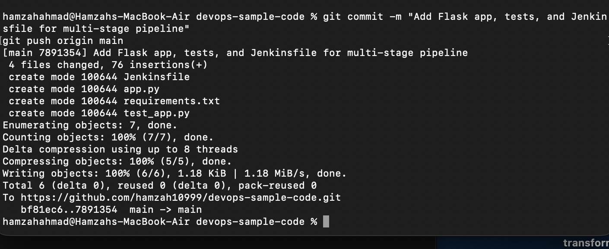
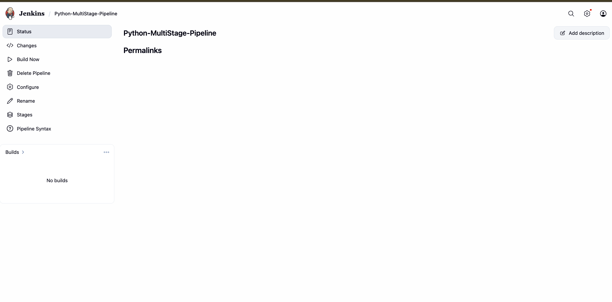
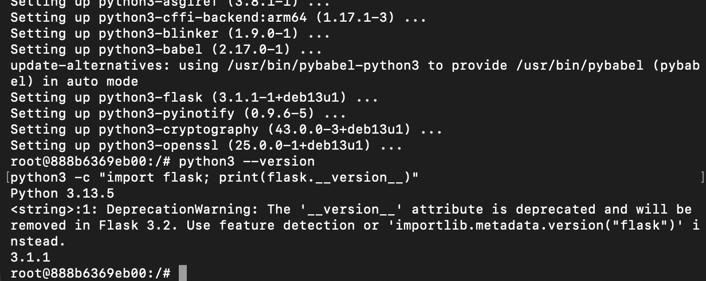
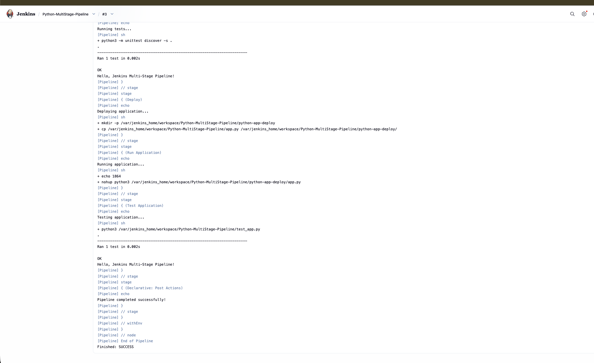

# Exercise 9: Jenkins Multi-Stage Pipeline — Deploying a Python Application

## Objective
Build a Jenkins **Pipeline** job (as opposed to a Freestyle job) that performs multiple stages — Build, Test, Deploy, Run, and a post-deploy Test — for a sample Flask application, demonstrating a realistic multi-stage CI/CD workflow.

## Scenario
Automate the CI/CD pipeline for a Python Flask application through five stages:
1. **Build** — install dependencies
2. **Test** — run unit tests
3. **Deploy** — copy the app to a mock deployment directory
4. **Run Application** — start the deployed app in the background
5. **Test Application** — verify the deployed copy also passes tests

## Step 1: Flask Application

`app.py`
```python
from flask import Flask

app = Flask(__name__)

@app.route("/")
def home():
    return "Hello, Jenkins Multi-Stage Pipeline!"

if __name__ == "__main__":
    app.run(debug=True)
```

`requirements.txt`

flask==2.1.2


`test_app.py`
```python
import unittest
from app import app

class TestApp(unittest.TestCase):
    def test_home(self):
        tester = app.test_client()
        response = tester.get("/")
        print(response.data.decode("utf-8"))
        self.assertEqual(response.status_code, 200)
        self.assertEqual(response.data.decode("utf-8"), "Hello, Jenkins Multi-Stage Pipeline!")

if __name__ == "__main__":
    unittest.main()
```

## Step 2: Jenkinsfile

```groovy
pipeline {
    agent any

    stages {
        stage('Build') {
            steps {
                echo 'Creating virtual environment and installing dependencies...'
            }
        }
        stage('Test') {
            steps {
                echo 'Running tests...'
                sh 'python3 -m unittest discover -s .'
            }
        }
        stage('Deploy') {
            steps {
                echo 'Deploying application...'
                sh '''
                mkdir -p ${WORKSPACE}/python-app-deploy
                cp ${WORKSPACE}/app.py ${WORKSPACE}/python-app-deploy/
                '''
            }
        }
        stage('Run Application') {
            steps {
                echo 'Running application...'
                sh '''
                nohup python3 ${WORKSPACE}/python-app-deploy/app.py > ${WORKSPACE}/python-app-deploy/app.log 2>&1 &
                echo $! > ${WORKSPACE}/python-app-deploy/app.pid
                '''
            }
        }
        stage('Test Application') {
            steps {
                echo 'Testing application...'
                sh '''
                python3 ${WORKSPACE}/test_app.py
                '''
            }
        }
    }

    post {
        success {
            echo 'Pipeline completed successfully!'
        }
        failure {
            echo 'Pipeline failed. Check the logs for more details.'
        }
    }
}
```

## Step 3: Push to the existing repository

Added to the same `devops-sample-code` GitHub repository from Exercise 8:

```bash
git add app.py requirements.txt test_app.py Jenkinsfile
git commit -m "Add Flask app, tests, and Jenkinsfile for multi-stage pipeline"
git push origin main
```



> **Note:** On the first attempt, the push silently failed to include all four files — `requirements.txt` and `test_app.py` had never actually been created on disk. Caught via `git status` showing them missing entirely (not even listed as untracked), which was the signal to recreate them before re-committing.

## Step 4: Create the Jenkins Pipeline job

In Jenkins: **New Item** → name `Python-MultiStage-Pipeline` → select **Pipeline** → **OK**.

## Step 5: Configure Pipeline from SCM

- **Definition:** Pipeline script from SCM
- **SCM:** Git
- **Repository URL:** `https://github.com/hamzah10999/devops-sample-code.git`
- **Branch Specifier:** `*/main`



## Step 6: First run — missing Python in the container

The first build run reached the Test stage and failed:
python3 -m unittest discover -s .
/var/jenkins_home/workspace/Python-MultiStage-Pipeline@tmp/durable-.../script.sh.copy: 1: python3: not found

The official `jenkins/jenkins:lts` Docker image is Java-based and does not ship Python at all. Remaining stages (Deploy, Run Application, Test Application) were correctly skipped by Jenkins due to the earlier failure.

## Step 7: Install Python directly inside the running Jenkins container

```bash
docker exec -it -u root jenkins bash
```

Inside the container:
```bash
apt-get update
apt install -y python3
apt install -y python3-pip
apt install -y python3.11-venv
apt install -y python3-flask
```

Verified the install:
```bash
python3 --version
python3 -c "import flask; print(flask.__version__)"
```



```bash
exit
```

> **Note on ephemerality:** this installs Python into the running container's writable layer, not into the underlying image. If the Jenkins container is ever removed and recreated (rather than just stopped and restarted), this installation step would need to be repeated, or baked into a custom Jenkins image via a `Dockerfile` for a production setup.

## Step 8: Re-run the pipeline — full success



[Pipeline] { (Test)

python3 -m unittest discover -s .
Ran 1 test in 0.002s
OK
Hello, Jenkins Multi-Stage Pipeline!

[Pipeline] { (Deploy)

mkdir -p .../python-app-deploy
cp .../app.py .../python-app-deploy/

[Pipeline] { (Run Application)

nohup python3 .../python-app-deploy/app.py

[Pipeline] { (Test Application)

python3 .../test_app.py
Ran 1 test in 0.002s
OK
Hello, Jenkins Multi-Stage Pipeline!

Pipeline completed successfully!
Finished: SUCCESS


All five stages passed: dependencies step, unit test, file deployment, background app launch, and a second test run against the deployed copy.

## Key Takeaways

- **Pipeline jobs** (Jenkinsfile-driven) differ from **Freestyle jobs** (Exercise 8) by defining the entire build process as code, checked into source control alongside the application.
- A bare Jenkins Docker image has no language runtimes installed — Python, Node, Java tooling, etc. all need to be added explicitly, either by installing into the running container (quick, but not persistent across container recreation) or by building a custom Jenkins image (the production-correct approach).
- Multi-stage pipelines let a single `Build Now` click exercise the full lifecycle of an application — build, test, deploy, run, and re-test the deployed artifact — mirroring a real CI/CD workflow.

## Additional Enhancements (Not Implemented)
- A **Code Quality** stage using `flake8` or `pylint`
- Deploying into a Docker container as part of the pipeline, rather than a local directory
- Build notifications via email or Slack on pipeline success/failure
